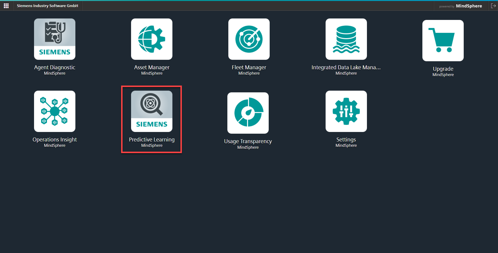
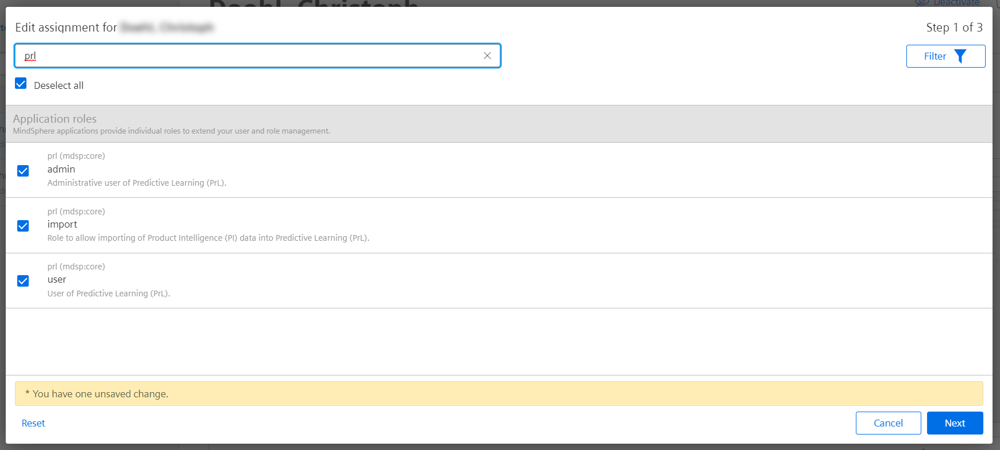
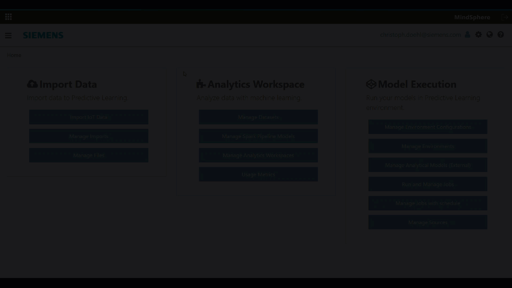

# MindSphere Predictive Learning Examples

# Welcome
* You are interested in MindSphere?
* You want to know, what analytical capabilities MindSphere offers for developers?
* You've heard about Predictive Learning and want to try it out?
* You're about to get started on your analytical journey and need code-snippets?
* You know already Predictive Learning but search for examples?
* You want to get inspired by other developers from the community?

This repository provides example notebooks to be used in MindSphere Predictive Learning (PRL). You can use them and try it out to get an impression what is possible. Additionally you can customize them to your use cases. And of course you can contribute to this repository and share your knowledge to others.

If you do not have already purchased the app, you can get it in the [MindSphere Store](https://www.dex.siemens.com/mindsphere/applications). Or if you do not already have a MindSphere account, get one at [MindSphere Start](https://www.mindsphere.io/start).

## How does this work

In the next chapter you will find example notebooks. There is sometimes a readme with a short description, what this notebook does - or it is integrated in the notebook.

## Example Overview

### Current examples in this repository

| Name | Description | Complexity Rating | Prerequisites |
| --- | --- | --- | --- |
| [Introduction Notebook](./00-introduction-notebook/IntroductionNotebook.ipynb) | Getting Started Notebook | | - |
| [Basics Interaction with MindSpehre APIs](./01-basic-api-interaction/basics-api-interaction.ipynb) | showing how to interact with MindSphere APIs and Services through integrated authentication | :star: | - |

### Examples to be added (idea pool):
| Name | Description | Complexity Rating | Prerequisites |
| --- | --- | --- | --- |
| [TODO: Interaction with IDL](./createRuleForAssetType/readme.md) | Create a rule for all assets of this type | :star: | - |

You can add here your ideas or requests for further examples.

### Add examples
You want to create your own example? Just send us your pull request.
## Remarks
Please note that the screenshots show just the current state, when these examples have been created. They might differ to the latest software release.

Each notebook might has to be adapted to your tenant. Ensure, that e.g. fixed tenant names or asset ids are adapted before/after running the code.

## Prerequisites
All application examples shown in this repository require the MindSphere Application *Predictive Learning (PRL)*. 

To use them, ensure that
- PRL is available in your MindSphere tenant ([PRL in MindSphere Store](https://www.dex.siemens.com/mindsphere/applications))

- you have *admin*, *user* and *import* role for PRL associated to your user, depending what you plan to do. ([PRL user role settings](https://documentation.mindsphere.io/resources/html/predictive-learning))

If you can see Predictive Learning on your Launchpad, you're ready to start developments. 

## Import of Examples

- To import any of the notebooks shown in this repository, open PRL application and start a compute cluster. 
- In the menu, select *Upload* and select the notebook downloaded from this repository
- Adjust your notebook as indicated in the individual examples

## Questions and answers
Feel free to ask your questions in the [MindSphere Developer Forum](https://community.sw.siemens.com/s/topic/0TO4O000000MihsWAC).

Or open an [issue](https://github.com/mindsphere/PredictiveLearning-examples/issues) if you find a bug in our examples.

You want to contribute? Your pull request is always welcome!!!